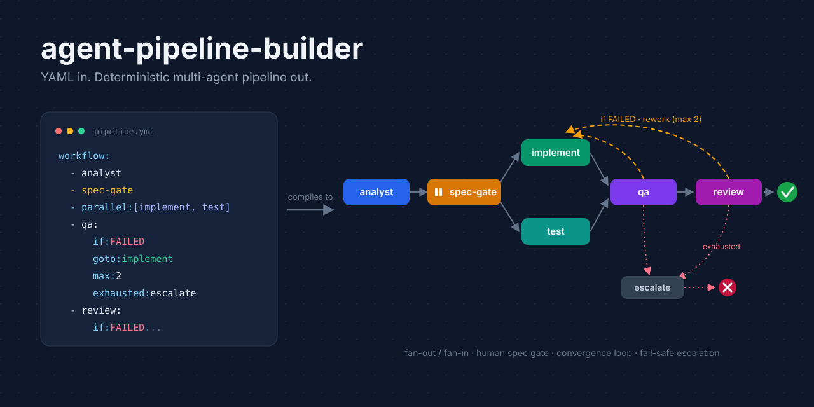

# graph-builder

**Build a multi-agent development orchestration for your project from a single sentence.**



graph-builder is a Claude Code plugin that scaffolds a self-contained, YAML-driven
agent pipeline into your repository. Describe your domain once, and the plugin
generates an orchestration skill, a specialized agent team, and the trigger wiring.
From then on, feature requests run through a deterministic graph:
analyze, confirm the spec, implement and test in parallel, verify, review,
and loop until acceptance passes.

```
graph-builder plugin
  ├─ graph-builder:build   # scaffold an orchestration (6 phases)
  └─ graph-builder:edit    # modify and diagnose an installed pipeline
        │
        ▼  "Set up a dev orchestration for this project"
<your-project>/
  CLAUDE.md                              # trigger rule (auto-registered)
  .claude/
    skills/<domain>-pipeline-dev/        # the orchestration skill (self-contained)
      SKILL.md · pipeline.yml · prompts/ · scripts/run_graph.py
    agents/<prefix>-analyst.md ···       # the agent team (role, model, tools)
```

The output runs on its own. Once scaffolded, the pipeline needs neither this
plugin nor any dependency beyond Python 3 and the `claude` CLI.

## Why graph-builder

- **Deterministic orchestration.** A script, not an LLM, schedules the graph:
  same input, same flow. Branching, fan-out/fan-in, feedback loops, and loop
  caps are enforced mechanically.
- **You own the pipeline in YAML.** The whole flow lives in one `pipeline.yml`.
  Reorder stages, tighten loops, or add a security-review node without touching
  any code.
- **Spec-driven by default.** The built-in pipeline pauses at a spec gate after
  analysis. You confirm scope and acceptance criteria before a single line of
  implementation runs.
- **Context isolation.** Every node starts as a fresh claude session. Nodes
  exchange only bounded handoffs, a summary plus a file path, so no context
  pollution accumulates.
- **Resume, don't redo.** Failed run? Fix the cause and `--resume`. Succeeded
  nodes are served from cache; only the failed path re-executes.
- **Transparent cost.** One node execution equals one claude session. The skill
  tells you the expected session count before it runs anything.

## Install

```
/plugin marketplace add <this-repo-url>
/plugin install graph-builder@graph-builder-marketplace
```

## Building an orchestration

In any project, say *"Set up a development orchestration"*. The `build` skill
walks six phases and asks for your confirmation where it matters:

1. **Audit.** Detects existing pipelines, agents, and CLAUDE.md markers.
   Maintenance requests get routed to `graph-builder:edit` instead of
   duplicating anything.
2. **Analyze.** Reads your stack, real build/test commands, and convention
   documents. Nothing is guessed.
3. **Design (you confirm).** Proposes the node/agent table and a mermaid
   diagram of the flow, plus the pipeline name (default
   `<domain>-pipeline-dev`), the agent prefix, and the default execution mode.
4. **Generate agents.** Writes `.claude/agents/<prefix>-*.md` with your real
   commands and pointers to your convention sources. Existing agents are
   reused, never duplicated.
5. **Generate the pipeline skill and register the trigger.** Scaffolds the
   skill directory and appends a marker block to your CLAUDE.md.
6. **Verify.** Validates the graph, mock-runs the gate and the convergence
   loop, and checks that no placeholder survived.

## What gets generated

For a project called `order-service` with prefix `order`:

```
order-service/
  CLAUDE.md                            # + trigger block (marker-delimited, replaceable)
  .claude/
    skills/order-pipeline-dev/
      SKILL.md                         # how to run: modes, spec gate, resume, evolution
      pipeline.yml                     # the flow — edit this to change the orchestration
      prompts/                         # per-node task input and pass/fail criteria
        analyst.md · implement.md · test.md · qa.md · review.md · escalate.md
      scripts/run_graph.py             # the engine (stdlib-only Python)
      references/session-mode.md       # rules for the observable session mode
    agents/
      order-analyst.md                 # role, working style, project facts
      order-implementer.md
      order-test-engineer.md
      order-qa.md
      order-reviewer.md
```

A generated agent carries the facts that make it useful on day one:

```markdown
---
name: order-implementer
description: order-service implementation specialist for the implement node.
---
## Project context
- Stack: Kotlin + Spring Boot multi-module Gradle
- Build: ./gradlew classes testClasses --parallel
- Conventions: AGENTS.md is the single source; domain rules live in .claude/skills/<domain>/
```

## Example: one feature request, end to end

```bash
$ PL=.claude/skills/order-pipeline-dev
$ python3 $PL/scripts/run_graph.py $PL/pipeline.yml \
    --var requirement="Add partial-refund support to the order API"

[10:02:11] ▶ analyst 시작 (iter 1)
[10:03:24] ✔ analyst SUCCEEDED (iter 1)
[10:03:24] ⏸ 게이트 spec-gate 도달 — 일시정지        # exit code 3
```

The analyst produced a spec draft and the questions worth asking. Claude reads
it and confirms the spec with you through a single AskUserQuestion round, then
resumes with the decisions injected:

```bash
$ python3 $PL/scripts/run_graph.py $PL/pipeline.yml --resume 20260731-100211-ab12 \
    --var requirement="..." \
    --var decisions="scope: refunds after settlement excluded; API: extend existing endpoint"

[10:07:02] ⏩ analyst 캐시 재사용
[10:07:02] ⏩ 게이트 spec-gate 통과 (이전 실행에서 확인됨)
[10:07:02] ▶ implement 시작 (iter 1)     # runs in parallel
[10:07:02] ▶ test 시작 (iter 1)          # with implement
[10:14:40] ▶ qa 시작 (iter 1)
[10:18:03] ✘ qa FAILED (iter 1)          # acceptance A3 failed
[10:18:03] ↻ 피드백 qa → implement (1/2)
[10:21:47] ✔ qa SUCCEEDED (iter 2)
[10:24:12] ✔ review SUCCEEDED (iter 1)
[10:24:12] ● END 도달
[10:24:12] ✔ 파이프라인 SUCCEEDED — 산출물: .graph-runs/20260731-100211-ab12
```

Every node's full prompt and output is preserved under `.graph-runs/<run-id>/`
for audit. Commits stay in your hands.

## The default pipeline

```yaml
workflow:
  - analyst                          # analysis, SDD spec draft, questions to confirm
  - spec-gate                        # ⏸ pause → confirm spec via AskUserQuestion → resume
  - parallel: [implement, test]      # implementation ‖ test authoring (fan-out)
  - qa:                              # fan-in: build, run, judge acceptance items
      if: FAILED                     # convergence loop: rework only what failed
      goto: implement
      max: 2
      exhausted: escalate            # repeated failure → report, then fail the run
  - review:                          # static review (approve → done; commits stay human)
      if: FAILED
      goto: implement
      max: 2
      exhausted: escalate
```

Each node runs with a project-specific agent definition from `.claude/agents/`,
carrying your real build commands, test commands, and convention pointers.

## Graph engineering cookbook

The default pipeline is one instance of a general graph language. Compose your
own from these patterns (they nest freely):

**Sequential chain** — batch jobs, migrations:

```yaml
workflow:
  - extract
  - transform
  - load
```

**Conditional routing (Expert Pool)** — the triage node reports a routing key
via `GRAPH_OUTPUT`, and each case gets its own sub-flow:

```yaml
workflow:
  - triage                    # GRAPH_OUTPUT: {"kind": "bug" | "feature" | "docs"}
  - branch:
      on: kind
      cases:
        bug: [reproduce, fix]
        feature: [design, implement]
        docs: update-docs
  - verify                    # merge point, joins on first arrival
```

**Quality gate chain** — fail fast with an explicit failure terminal:

```yaml
workflow:
  - build-check:
      if: FAILED
      goto: [report-failure, FAIL]
  - security-scan:
      if: FAILED
      goto: [report-failure, FAIL]
  - deploy-ready
```

**Human checkpoint** — pause anywhere a person must decide before the graph
continues:

```yaml
nodes:
  - id: approve-plan
    gate: true
workflow:
  - plan
  - approve-plan              # pauses; resume injects the confirmed values
  - execute
```

## What the YAML can express

| Capability | Syntax |
|---|---|
| Sequential / parallel stages | list order / `parallel: [a, b]` |
| Status-driven jump or loop | attach `{if: FAILED, goto: ...}` to a node (backward goto = feedback loop) |
| Multi-case routing | `branch: {on: <output-key>, cases: ...}` |
| Scoped loop block | `loop: {body, redo, max, exhausted}` |
| Human checkpoint | `gate: true` node — pauses (exit 3), resume with confirmed values |
| Low-level edges | `edges:` with `when` expressions such as `route == heavy`, `to: FAIL` termination |
| State and resume | `.graph-runs/<run-id>/state.json`, `--resume` with cached successes |
| Dry verification | `--validate`, `--dry-run`, `--mermaid`, `--mock` with scripted statuses and outputs |

Agents report `GRAPH_STATUS: SUCCEEDED|FAILED` and optional
`GRAPH_OUTPUT: {"key": "value"}` on their last lines; the runner injects the
protocol automatically and evaluates every conditional edge from it.

## Two execution modes

| | Runner (default) | Session |
|---|---|---|
| Orchestrated by | `run_graph.py` script | Claude, via the Agent tool |
| Guarantees | Deterministic, resumable, zero orchestration cost | Follows the same YAML, interpreted |
| Observability | Console log + `run.log` + per-node output files | Live subagent tree in the Claude Code UI |
| Best for | Unattended, large, or repeated runs | Watching, debugging, intervening |

Set the default with `settings.mode` in `pipeline.yml`, and override it per run
by simply asking ("run it in session mode").

## Operating notes

- **Cost ceiling.** Maximum sessions ≈ node count + (feedback nodes × loop max).
  The registered trigger excludes thin single-file changes by default.
- **Human gates.** Headless nodes cannot ask questions. Spec confirmation
  happens at the gate; commits and merges happen after the run, by you.
- **Evolution loop.** Feedback maps to a concrete fix target (prompts, agents,
  or YAML), and `graph-builder:edit` applies changes with validation and a
  changelog entry.

## Plugin layout

```
.claude-plugin/                     # manifest + self-hosted marketplace
skills/
  build/                            # graph-builder:build — the scaffolder
    SKILL.md                        # 6-phase procedure
    scripts/run_graph.py            # the engine (copied into every output)
    templates/pipeline-dev/         # output skill skeleton (SKILL.md, yml, prompts)
    templates/agents/               # agent definition skeletons (5 roles)
    references/                     # yml spec, team patterns, agent guide,
                                    # prompt guide, session-mode rules
  edit/                             # graph-builder:edit — change & diagnose
```
